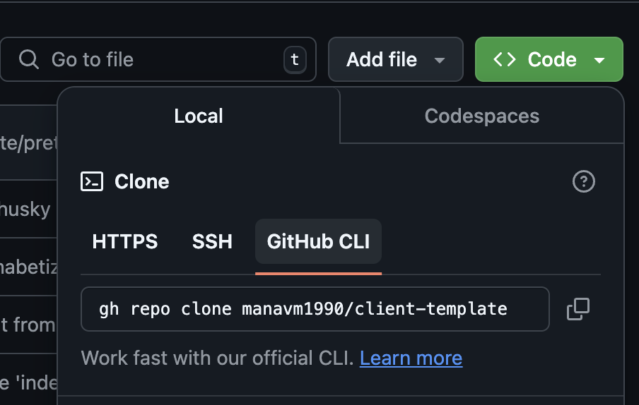

# Node Template Repo

This repo should provide a stable template for practicing learning JS as a programming language and just 🏃‍♂️ running code from the terminal via Node.

## Getting Started

Utilize your GitHub Classroom link or click the "Use this template" button to create a new repo. This will create a new repo with the same structure as this one on your GitHub account.

Clone the repo to your local machine by clicking the green "Code" button. Normally, the easiest way to do this is the GitHub CLI, assuming that you have it installed. If not, you can download it [here](https://cli.github.com/). You also need to run `gh auth login` to authenticate your GitHub account. One other with the GitHub CLI is that you may have to restart your terminal after installing it.

You'll copy the command by clicking the copy icon there ☝️. Navigate to your `Code` or `Dev` or whatever directory you have where you are keeping your code projects and paste the command in.

⚠️ DO NOT clone a repo inside another repo. This will cause issues with git and you'll have to delete the inner repo to fix it. Make sure that you are in a directory that is not a git repo before cloning. To put it another way, if you see the annotation `(master)` or `(main)` in your terminal, you are in a git repo. You can check by running `git status`. If you see `fatal: not a git repository (or any of the parent directories): .git`, you are not in a git repo.

So, again, make sure you are not in a git repo before cloning this repo. No nested repos, please 🙏:🏾.

First, `cd` into the newly created repo. You can do `ls` to check for it and then type `cd` followed by at least the first few characters of the repo name. You will now have changed into the repo directory (it will probably show `(master)` or `(main)`.

Now, it's time to install the project's dependencies. You can do this by running `npm install` in the root of the project. This will install all the dependencies listed in the `package.json` file.

Summarily, this checks the `package.json` file for the necessary `"dependencies"` and/or `"devDependencies"`. It communicates with the npm registry to download the necessary packages and install them in the `node_modules` directory. This directory is created in the root of the project and is where all the dependencies are stored. This directory is ignored 🙈 by Git because it is so bloated.

Now, open the code up with `code .`. This runs the `code` command (for VS Code) and opens the current directory (`.`) in the editor.

You should see a `.vscode` directory in the root of the project. This directory contains the settings and extensions that are recommended for this project. You should see a notification in the bottom right corner of the editor that says "Recommended Extensions Found". Click "Install All" to install the recommended extensions.
If you don't, then hopefully 🤞🏾 that means that you have already installed the extensions.

Check out the files - you'll see HTML, CSS, and JS files (if needed) in `src`.

> Do what must be done.

Write your code in `src`. Run your code with `node src/index.js` (or similar).
